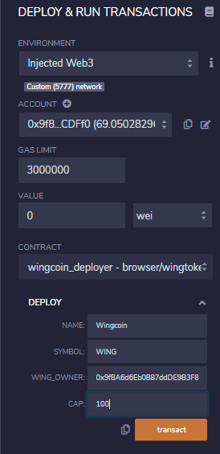
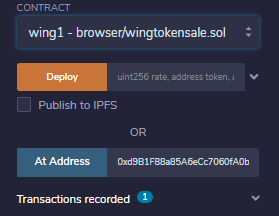

Crowdfunding contract:

This contract is a different approach to the donation purposes. It has a cap on the maximum value that can be taken as donations and also time limit on the donation acceptance.

How this contract makes a difference:

1. The cap on the maximum amount that can be raised can be changed as per requirement of project.

2. The time limit in which the organization can accept the donations can be picked per requirement too.

3. The rate at which the token are generated depending on the amount of donations can be varied. Though this does not change the amount of donations made, it can create an impact among the donars as it changes the number of tokens they will receive after donation.

How the contract works:

1. A contract is created with the specifications of the token that will be distributed to the donars. The specifications include: ERC20, ERCDetailed, ERCMintable. This contract also generates initial supply of tokens.

2. This contract is then imported to the contract where the crowdsale is created. This file contains two contracts. One for deploying the coin and other to receive donations.

3. The coin deployer contract also has the minting function, which facilitates the minting of tokens to be distributed to donars.

4. As the crowdsale contract has the features of capped and timed crowdsale, these features can be determined while deploying the contract: while creating a new crowd sale.

Steps to deploy:

1. Deploy the coin deployer contract.

Metamask confirmation:

2. Copy the token sale address from the deployer contract and run the address. As the crowdsale is token is saved in this address, any beneficiery will be able to then buy the tokens using the token sale contract.

3. Any beneficiery will be able to buy tokens at this point by donating any amouont that does not exceed the cap amount and if it is in the specific timeline when the contract is open.

4. Once the cap is reached, the change in the flags can be noticed.

ROMAN README

#Project 3

This repo will be used to research and develop outlines for our project and house our code once we begin development. I think there is also a case to be made for using google drive documents as well. 

### Social Development Fund / .. (Other ideas for names)

## “Slogan”

[ PHOTOS ]

## Introduction 
# Organizations such as charities raise money for a purpose but tracking their expenses is another story. Through Charitynavigator's API we were able to ingest data from thousands of IRS good standing organizations with its rankings based on a charity's financial health and the charity's Accountability & Transparency. What the database doesn't include is the thousands of organizations claiming to be a charity but is under investigation by the IRS. These organizations cause a lack of trust for donors, making fundraising so much harder for good standing charities.

# In our current reality, chunks of fundraised donations will be used to pay operating and processing fees for middlemen. We envision a way for donations raised to be invested directly to the causes that matter most to the people. Improving financing efficiencies whether it be for a charitable cause, aiding world disaster, alleviate global poverty, and much more. Blockchain records will securely keep public transactions made by the party recipient with the funds raised. Using smart contracts, funds will only be used for the causes they contribute. By using blockchain, we devise methods of lowering transaction & taxation fees when donating to a cause, develop smart contracts to enforce funding terms, and ensure less there is less money to middlemen and more money for the campaign. 

# Our solution to this problem, helping organizations gain trust with donors was to create a platform where a charity can create fundraising, clearly stating its intent and project scope, openly share the budget allocation including each recipient's wallet, create a crowdfunding campaign and deploy it. Our hope is to give more power to individuals donating by the ability to see where funding is spent, giving a more direct and personal connection via their contributions and the collective causes that matter the most to them.

