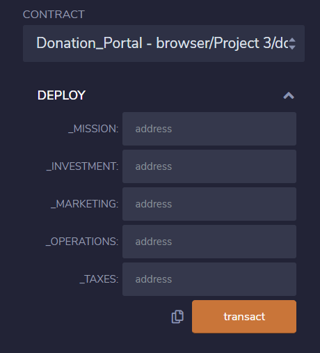
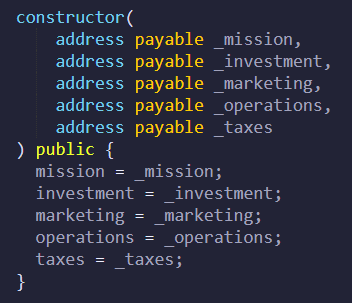
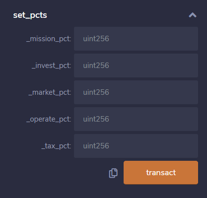
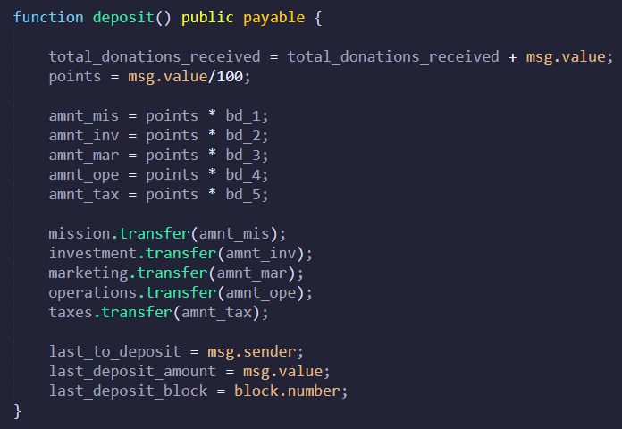
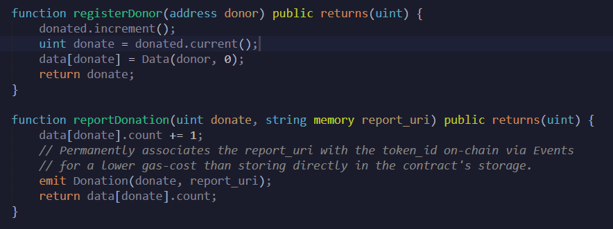

## Charitable Organization Money Trail

### “No More Mystery”

### Introduction 
Organizations such as charities raise money for a purpose, but tracking their expenses is another story. Through Charity Navigator's API we were able to ingest data from thousands of IRS good standing organizations, which have been rated based on the given charity's financial health, accountability, and transparency indices. However, what the database does not include is the thousands of organizations claiming to be a charity, but are currently under investigation by the IRS. These organizations induce a lack of trust for donors, making fundraising much harder for good standing charities.

In our current reality, chunks of fundraised donations will be used to pay operating and processing fees for middlemen. We envision a way for donations raised to be invested directly to the causes that matter most to the people, whether it be a charitable cause, aiding world disaster, alleviating global poverty, or much more. The use of blockchain and smart contracts will provide traceability and accountability, ensuring funds raised will only be used for the cause in which they contributed. Additionally, by using blockchain we devise methods of lowering donation transaction and taxation fees, as well as enforcing terms outlined in smart contracts with each donation.  This ensures more funds are provided directly to a campaign, rather than funding a middleman.

Our solution to this donor/organization trust problem was to create a platform where a charity can: create fundraising clearly stating its intent and project scope, openly share the budget allocation (including each recipient's wallet), and create and deploy a crowdfunding campaign. Our hope is to give more power to individuals donating via the ability to see where funding is spent.  This will in turn give donors a more direct and personal connection to their contributions and the collective causes that matter the most to them.

## Institution Designed Donation Contract

#### Current Functionality Overview
The set up for this contract was conceptualized to provide donation breakdown power to the recipient. As such, once deployed, it facilitates the division and simultaneous transfer of any donations made to the target. This contract is meant for organizations with healthy reputations, to be used by unconcerned donors who trust the institution to use the donations in the most effective manner. The current format of the contract allows for the deploying wallet owner to set up to five recipient wallet addresses to receive donations. There is no logic in place to prevent the same wallet being used for each field.

  

Once the contract has been deployed, the owner can enumerate how a standard donation will be allocated between the wallets. Currently only integer percentages are accepted and the sum of the breakdown percentages must equal 100 otherwise the transaction fails. Using uint values protect the contracts from integer underflow attacks, while instantaneous deposits prevent re-entrancy attacks.

 

Once the division has been set, all the institution needs to do is sit back, relax and let the donations roll in! Once a donor submits their donation deposit, it is divided up and deposited directly into the pre-provided wallets per the percentages. It is important to note that the donations made through this wallet have no refund functionality, nor control over funds once executed and assets are delivered.

#### Future Functionality Overview
Included within the contract now, there are functions which will be implemented in the future. We want to be able to track the total amount donated by the individual platform users, for this contract, and others. This could allow the functionality of leaderboards, possible reward thresholds, and additional functionality later on. However, this is out of the scope of our current project so it will be implemented later.

### Crowdfunding Contract: Payment Per Project
#### Overview and Deployment Instructions

This contract is a different approach to the donation purposes. It has a cap on the maximum value that can be taken as donations and as well as a time limit on the donation acceptance.

**How this contract makes a difference:

1. The cap on the maximum amount that can be raised can be changed as per requirement of the project.

2. The time limit in which the organization can accept the donations can be picked per requirement too.

3. The rate at which the tokens are generated depending on the amount of donations can be varied. Though this does not change the amount of donations made, it can create an impact among the donors as it changes the number of tokens they will receive after donation.

How the contract works:

1. A contract is created with the specifications of the token that will be distributed to the donors. The specifications include: ERC20, ERCDetailed, ERCMintable. This contract also generates initial supply of tokens.

2. This contract is then imported to the contract where the crowdsale is created. This file contains two contracts. One for deploying the coin and other to receive donations.

3. The coin deployer contract also has the minting function, which facilitates the minting of tokens to be distributed to donors.

4. As the crowdsale contract has the features of capped and timed crowdsale, these features can be determined while deploying the contract: while creating a new crowd sale.

Steps to deploy:

1. Deploy the coin deployer contract.

Metamask confirmation:

2. Copy the token sale address from the deployer contract and run the address. As the crowdsale token is saved in this address, any beneficiary will be able to then buy the tokens using the token sale contract.

3. Any beneficiary will be able to buy tokens at this point by donating any amount that does not exceed the cap amount and if it is in the specific timeline when the contract is open.

4. Once the cap is reached, the change in the flags can be noticed.

